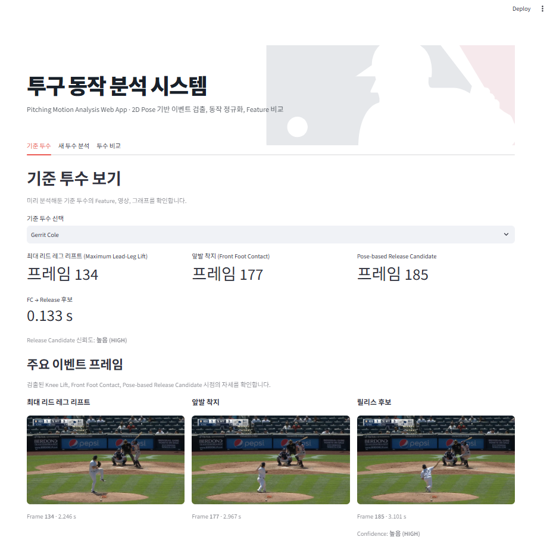
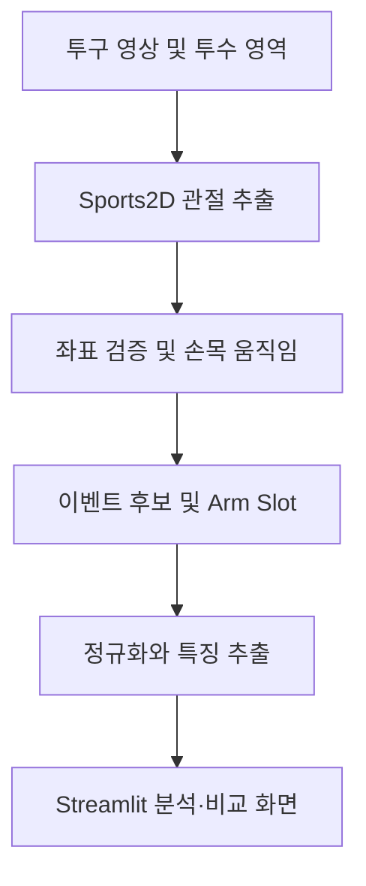
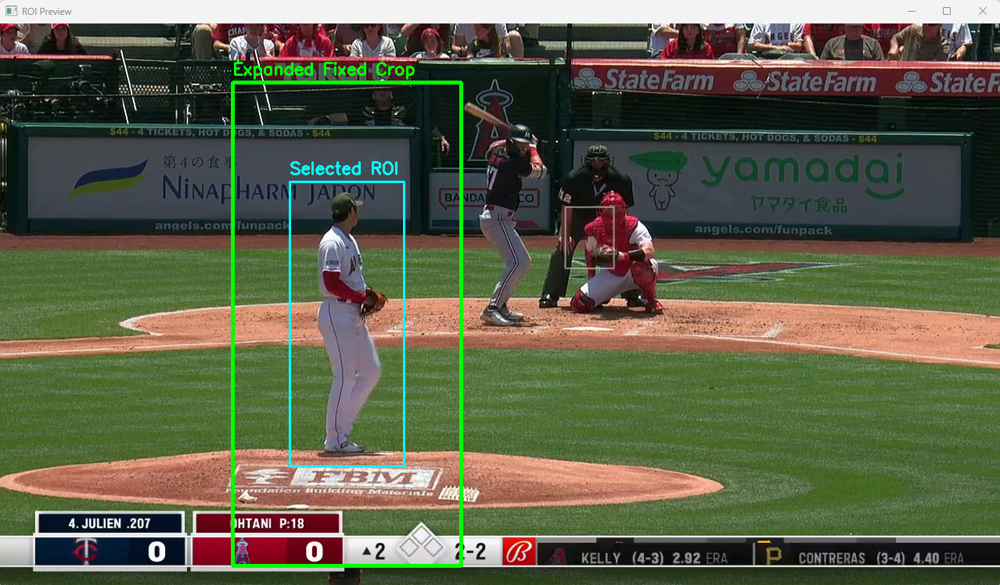
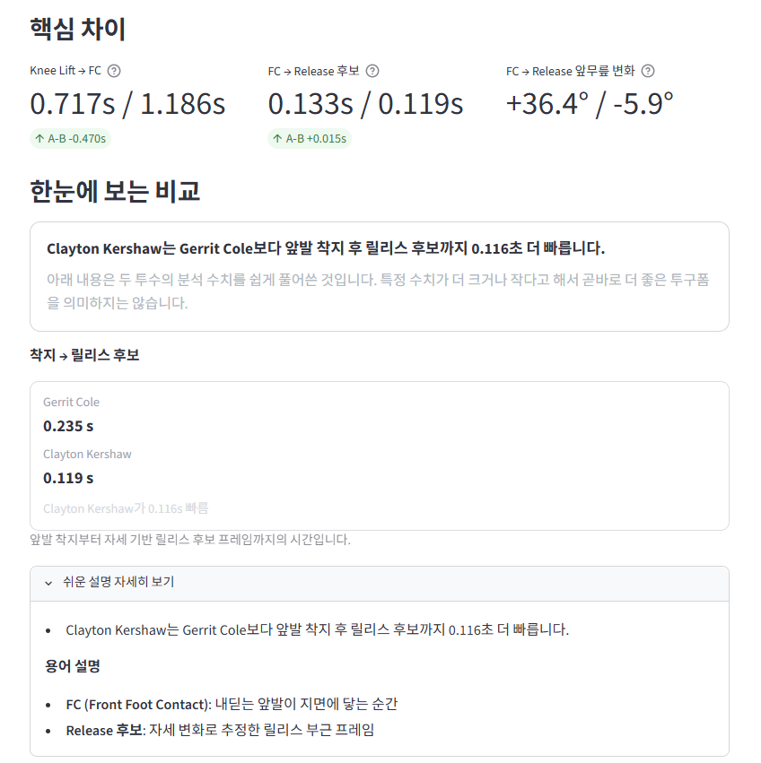
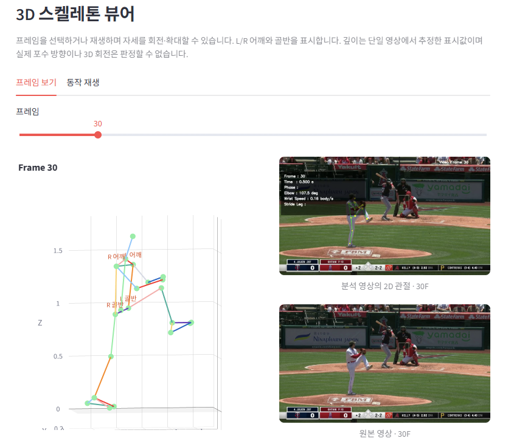

<div align="center">

# ⚾ 투구 영상을 이용한 AI 기반 투구폼 분석 시스템

**일반 투구 영상에서 주요 동작을 찾고, 검토하고, 비교하는 반자동 분석 도구**

부산대학교 졸업과제 · 2026 · 11조 오타니

</div>

> **한 문장으로:** 투구 영상을 올려 투수 영역을 지정하면 관절 움직임과 주요 이벤트 후보를 분석하고, 사용자가 원본 영상에서 결과를 검토·수정한 뒤 다른 투수와 비교할 수 있습니다.



<div align="center"><sub>기준 투수의 Knee Lift, 앞발 착지, 릴리스 후보 프레임</sub></div>

## 1. 프로젝트 배경

### 1.1. 국내외 시장 현황 및 문제점

투구폼 분석에는 반복 재생과 육안 관찰 또는 별도의 측정 장비가 쓰입니다. 일반 영상만으로 주요 동작 시점을 일정한 기준으로 찾고 여러 투수의 시간 흐름을 비교하기는 어렵습니다. 단일 카메라 영상에서는 촬영 각도, 관절 가림, 화질에 따라 추정값이 달라집니다. 착수 단계에는 공 궤적의 다중 시점 시각화를 기획했으나, 방송 영상의 작은 공과 빠른 움직임, 가림, 모션 블러 때문에 투수 자세 기반의 반자동 분석으로 방향을 바꿨습니다.

> **자료 보완:** 기존 국내외 서비스의 기능·비용·적용 범위를 조사한 뒤 출처를 붙여 비교합니다. 확인하지 않은 시장 규모나 성능 수치는 기재하지 않습니다.

### 1.2. 필요성과 기대효과

별도의 모션 캡처 장비 없이 촬영한 영상에서 관절 위치와 이벤트 후보를 정리합니다. 원본 프레임과 분석 결과를 함께 보여주고 수동 보정을 허용해, 투구 동작을 확인하고 비교하는 과정을 돕습니다.

## 2. 개발 목표

### 2.1. 목표 및 세부 내용

| 단계 | 하는 일 | 사용자에게 제공하는 결과 |
| --- | --- | --- |
| 영상 준비 | 업로드, 투수 정보 입력, 첫 프레임에서 투수 영역 선택 | 분석 대상이 지정된 영상 |
| 관절·이벤트 분석 | Sports2D 관절 추출, Knee Lift·FC·Release Candidate 구성 | 관절 데이터와 주요 프레임 |
| 검토·보정 | 원본 영상과 이벤트 후보 대조 | 사용자가 수정한 이벤트 프레임 |
| 시각화·비교 | 특징 추출, 시간축 정규화, 투수 간 비교 | 분석 영상, GIF, 그래프, 3D 추정 뷰어 |

### 2.2. 기존 서비스 대비 차별성

자동으로 찾은 이벤트 후보를 원본 프레임에서 확인하고 수정할 수 있습니다. 길이가 다른 투구를 정규화된 진행률 기준으로 비교하며, 원본 영상·2D 관절 화면·추정 3D 뷰를 함께 제공합니다. 특정 서비스보다 정확하거나 우수하다는 주장은 비교 실험 전까지 하지 않습니다.

### 2.3. 사회적 가치 도입 계획

전문 장비가 없는 사용자도 보유한 영상으로 동작을 살펴볼 수 있도록 접근성을 고려합니다. 측정 한계와 후보 검출의 불확실성을 표시해 수치만으로 실력이나 부상 위험을 판단하지 않도록 합니다.

## 3. 시스템 설계

### 3.1. 시스템 구성도



사전 학습된 Sports2D 모델로 관절을 추출합니다. 사용자가 지정한 투수 영역의 크롭 좌표는 원본 영상 위치로 복원합니다. 이후 손목 움직임과 관절 자세를 이용해 이벤트 후보 및 동작 특징을 계산합니다. 별도의 3D 인체 자세 추정 모델을 학습하지 않았습니다.

### 3.2. 사용 기술

| 영역 | 기술 | 용도 |
| --- | --- | --- |
| 실행·웹 화면 | Python 3.12, Streamlit | 분석 앱과 사용자 화면 |
| 관절 추출 | Sports2D | 영상의 관절 좌표·TRC 추출 |
| 영상·수치 처리 | OpenCV, NumPy | 영상 처리와 동작 계산 |
| 그래프·뷰어 | Plotly | 비교 그래프와 3D 추정 시각화 |
| 영상 배속 | ffmpeg | 배속 영상 생성(선택) |

## 4. 소개 및 시연 영상

### 4.1. 프로젝트 소개 자료

발표 자료와 보고서를 `docs/`에 올린 뒤 여기에 링크를 연결합니다.

### 4.2. 졸업과제 소개 동영상

졸업과제 소개 동영상이 [부산대학교 정보컴퓨터공학부 YouTube 채널](https://www.youtube.com/channel/UCl6NSPKixz2Jdt1F5SwdVOQ)에 업로드되면 **해당 동영상의 개별 링크를 이 위치에 연결**합니다. 현재는 게시 전이므로 영상 링크를 기재하지 않습니다.

<!-- 게시 후 예시: [▶ 11조 오타니 졸업과제 소개 동영상](https://www.youtube.com/watch?v=실제영상ID) -->

## 5. 개발 결과

### 5.1. 전체 시스템 흐름도

1. 영상을 업로드하고 첫 프레임에서 투수 영역을 지정합니다.
2. Sports2D 관절 데이터를 추출하고 원본 영상 좌표계로 복원합니다.
3. 관절 유효성과 손목 움직임을 검토해 Knee Lift, FC, Release Candidate를 구성합니다.
4. 사용자가 원본 영상에서 후보를 확인하고 필요한 프레임을 수정합니다.
5. 시간축을 정규화하고 특징을 추출해 영상, 그래프, GIF 및 투수 비교 화면에 표시합니다.



<div align="center"><sub>청록색은 사용자가 선택한 영역, 초록색은 분석에 사용하는 확장 영역</sub></div>

### 5.2. 기능 설명 및 주요 기능 명세서

| 기능 | 입력 | 출력·설명 |
| --- | --- | --- |
| 새 투수 분석 | 영상, 이름, 투구 손, ID, 선택 영역 | 관절 데이터 및 투구별 분석 결과 |
| 이벤트 확인·보정 | 원본 영상 및 자동 후보 | Knee Lift, FC, Release Candidate의 프레임 이미지와 수동 보정 |
| 동작 그래프·GIF | 관절 및 특징 데이터 | 리드 레그 리프트, 상대 무릎 높이, 투구팔 움직임, 어깨선 변화 |
| 투수 비교 | 분석된 투수 두 명 | 영상, 팔·다리 GIF, 이벤트 간 시간, 앞무릎 2D 각도 변화 |
| Arm Slot | 릴리스 후보 주변 2D 자세 | 오버핸드·쓰리쿼터·사이드암·언더핸드 분류 |
| 3D 스켈레톤 뷰어 | TRC, 선택 프레임 | 추정 좌표의 회전·확대·재생, 원본·2D 화면 대조 |



<div align="center"><sub>두 투수의 이벤트 간 시간과 앞무릎 2D 각도 변화 비교</sub></div>



<div align="center"><sub>프레임별 추정 시각화와 원본 영상 대조</sub></div>

분석 영상은 0.5×·1×·1.5×·2× 재생 속도를 선택할 수 있습니다. 상대 무릎 높이와 앞다리 움직임은 첫 프레임부터 릴리스 후보까지 보여줍니다. 어깨선 변화 그래프는 FC에서 릴리스 후보까지 **영상에서 보이는 어깨 사이 가로 간격을 몸통 길이로 정규화한 값**이며, 실제 3D 어깨 회전각이나 열림 시점의 좋고 나쁨을 자동 판정하지 않습니다. 3D 뷰어에서는 선택 프레임의 원본 영상과 2D 관절 화면을 곁에 두어 대조합니다.

기준 투수 여섯 명(콜, 세일, 로저스, 벌랜더, 휠러, 커쇼)의 분석 결과를 사용합니다. 기준 투수의 검토된 Knee Lift 프레임은 우선 적용하며, 새 영상은 FC 이전 리드 무릎의 몸통 길이 대비 상대 높이에서 최고점 후보를 찾습니다. 유효 관절 프레임이 부족하면 프레임을 임의로 만들지 않습니다. 새 영상의 중단 지점부터 이벤트 생성 단계를 재개할 수 있도록 구성했습니다.

**시스템 및 영상의 한계:** 촬영 구도, 가림, 흔들림, 화질과 투수 영역 선택에 따라 관절 추정이 불안정할 수 있습니다. 새로 업로드한 일부 영상에서는 3D 뷰어와 함께 표시되는 2D 관절 화면이 원본 프레임의 투수 위치와 어긋나는 사례가 있습니다. 일부 3D 화면에서는 좌우 관절 라벨이나 깊이 방향도 어색하게 표시될 수 있습니다. 이 경우 원본 프레임과 대조해야 합니다. 이를 모든 단일 카메라 분석의 필연적인 오차로 일반화하지 않습니다.

**결과 해석:** 단일 카메라로 관찰한 2D 동작입니다. 3D 화면의 깊이는 실제 측정한 깊이가 아닌 표시용 추정값입니다. 릴리스 후보는 공이 손에서 떨어진 순간을 직접 검출한 값이 아닙니다. 촬영 각도가 다른 영상의 수치로 투구폼의 우열이나 부상 위험을 판단하지 않습니다. Arm Slot 분류는 Statcast의 3D Arm Angle과 동일하지 않습니다.

### 5.3. 디렉터리 구조

```text
├─ app/                 # Streamlit 웹 화면
├─ src/
│  ├─ core/            # 정규화 및 특징 추출
│  ├─ pipelines/       # 분석 단계 연결 및 이벤트 메타데이터
│  └─ sports2d/        # Sports2D 결과 처리
├─ docs/
│  └─ images/          # README에 사용하는 화면 이미지
├─ data/raw_videos/     # 입력 영상(공개 가능 여부 확인)
├─ sports2d/            # 입력과 단계별 관절 결과
└─ pipeline_outputs/    # 투구별 분석 결과
```

대용량 영상과 중간 산출물을 공개 저장소에 포함할지는 권리와 용량을 확인한 뒤 결정합니다.

### 5.4. 산업체 멘토링 의견 및 반영 사항

| 산업체 멘토 의견 | 반영 내용 |
| --- | --- |
| 최종 서비스의 목적과 UI 흐름을 명확히 할 것 | 기준 투수 조회·새 영상 분석·투수 비교를 Streamlit 화면으로 연결하고, 주요 이벤트의 원본 프레임과 수동 보정 기능을 제공 |
| 반투명 실루엣으로 투구폼을 직관적으로 비교할 것 | 시각적 비교 방안을 검토하고, 현재 화면에는 투구팔·앞다리 동작 GIF와 영상·그래프 비교를 제공 |
| 추출 수치가 투구폼 차이를 보여주는지 테스트·검증할 것 | 여러 투구 유형의 기준 투수로 이벤트와 Arm Slot을 검토. 정량 성능 평가와 외부 기준값 검증은 아직 완료했다고 주장하지 않음 |

교수 피드백과 산업체 멘토링 내용을 혼동하지 않도록 구분합니다.

## 6. 설치 및 실행 방법

### 6.1. 설치절차 및 실행 방법

- 준비 환경: Python 3.12, Sports2D 실행 환경
- 선택 사항: 영상 배속 생성용 `ffmpeg` (없으면 원본 속도로 재생)
- 의존성 설치 명령, Streamlit 진입점과 포트는 실제 업로드한 코드·설정 파일을 확인한 뒤 기재합니다.

<!-- 코드 업로드 후 검증한 명령어를 Windows PowerShell 기준으로 여기에 추가하세요. -->

### 6.2. 오류 발생 시 해결 방법

| 증상 | 확인할 사항 |
| --- | --- |
| 투수 관절이 일부 잘림 | 첫 프레임에서 팔끝과 양발까지 포함해 영역을 다시 지정 |
| 이벤트 후보가 어긋남 | 원본 프레임을 확인하고 Knee Lift·FC·Release를 수동 보정 |
| 좌우 관절 또는 3D 자세가 어색함 | 원본 영상과 해당 프레임의 2D 관절 화면을 대조 |
| 배속 영상이 생성되지 않음 | `ffmpeg` 설치 여부 확인; 원본 속도 재생 가능 |

## 7. 팀 구성

### 7.1. 팀원별 소개 및 역할 분담

**11조 오타니**

| 이름 | 담당 | 주요 기여 |
| --- | --- | --- |
| 권성훈 | 관절·분석 파이프라인 | 투수 추적 및 Pose 처리, 관절값 검증, 이벤트 검출, 특징 추출과 시간축 정규화 |
| 홍혜진 | 웹 UI·비교 | 기준 투수 데이터, 비교 그래프, Streamlit 화면, 이벤트 수동 보정 |

### 7.2. 팀원별 참여 후기


## 8. 참고 문헌 및 출처

- [Sports2D](https://github.com/davidpagnon/Sports2D): 영상 기반 관절 추출 도구. 사용 버전과 라이선스를 확인해 기재합니다.
- 사용한 영상·이미지의 원출처와 이용 조건은 공개 자료를 게시할 때 각각 추가합니다.
- [부산대학교 2026 졸업과제 저장소 템플릿](https://github.com/pnucse-capstone2026/Capstone-Template-2026)

---

<div align="center"><sub>11조 오타니 · 부산대학교 · 2026 졸업과제</sub></div>
